# BMW Sales Analysis Report (2020–2024)

## 1. Executive Summary

- **Sales recovered after a 2023 dip:** Global BMW sales grew from **16.3M units in 2020 to 17.5M in 2024**, with a strong **+7.7% YoY rebound in 2024** following a **-9.2% decline in 2023**, indicating restored demand and improved supply/market conditions.

- **Regional performance is balanced and premium-led:** All major regions delivered **similar total volumes (13.6M–14.6M units)** and **high average selling prices (ASP) around USD 74k–76k**, underscoring BMW’s consistent premium positioning across markets rather than over-reliance on any single geography.

- **Asia and Europe anchor value creation:** While volumes are broadly comparable, **Asia and Europe lead on revenue**, each generating **~USD 1.06–1.10T** over 2020–2024 with **the highest ASPs (Asia: ~USD 76.3k; Europe: ~USD 75.2k)**, confirming these regions as the core profit engines.

- **Portfolio strength is broad, not concentrated:** Multiple nameplates (X6, 7 Series, 3 Series, M5, 5 Series) each deliver **USD 580B–609B in revenue** over the period, with **no single model dominating**, which reduces product concentration risk and supports pricing power across segments.

- **Price is not driven by engine size or mileage alone:** Engine size shows **only modest variation in price** (mostly mid-USD 70k range), and the **near-zero correlation between price and mileage (-0.009)** suggests BMW’s pricing is driven more by brand, technology, and trim content than by traditional mechanical attributes.

### Illustrative Snapshot – Regional Sales & Revenue (2020–2024 Aggregate)

| Region         | Total Sales Volume | Total Revenue (USD) | Avg Price (USD) | Weighted ASP (USD) |
|----------------|--------------------|---------------------|------------------|---------------------|
| Africa         | 14,007,790         | 1,049,537,737,781   | 74,993.38        | 74,925.29           |
| Asia           | 13,865,269         | 1,058,200,224,590   | 76,259.76        | 76,320.21           |
| Europe         | 14,565,989         | 1,095,358,238,984   | 75,281.11        | 75,199.72           |
| Middle East    | 14,528,396         | 1,089,724,985,475   | 74,760.86        | 75,006.56           |
| North America  | 14,301,712         | 1,069,797,046,426   | 75,107.61        | 74,802.03           |
| South America  | 13,643,807         | 1,017,875,575,518   | 74,378.02        | 74,603.49           |

## 2. Sales Performance Over Time

### 2.1 Global Sales Trend 2020–2024

BMW’s global sales over the period show a **recovery and growth phase (2020–2022)**, a **notable correction (2023)**, and a **rebound (2024)**:

| Year | Sales Volume (units) | YoY Growth % | Commentary |
|------|----------------------|-------------:|------------|
| 2020 | 16,310,843           |    –         | COVID baseline; disrupted demand and supply chains. |
| 2021 | 16,884,666           |   +3.52%     | Early recovery; gradual normalization of production and demand. |
| 2022 | 17,920,946           |   +6.14%     | Strong acceleration; peak volume in the period. |
| 2023 | 16,268,654           |   -9.22%     | Sharp slowdown; demand softening and/or supply constraints. |
| 2024 | 17,527,854           |   +7.74%     | Robust rebound; near-record volumes, signaling renewed momentum. |

**Key inflection points**

- **2021–2022: Acceleration phase**
  - Two consecutive years of positive growth, with **YoY growth rising from +3.5% to +6.1%**.
  - Indicates successful post-pandemic recovery and strong product/market fit.

- **2023: Clear inflection to slowdown**
  - **-9.2% YoY decline** marks the most significant contraction in the series.
  - Likely driven by a combination of macroeconomic headwinds (inflation, interest rates), model changeovers, and/or regional demand shifts.

- **2024: Rebound and renewed growth**
  - **+7.7% YoY** growth from a lower 2023 base.
  - Suggests that corrective actions (pricing, incentives, product launches, or mix optimization) have been effective in restoring volume.

Overall, the 5-year pattern is **net positive**, with 2024 volumes above 2020 and close to the 2022 peak, but with **heightened volatility** that needs to be managed going forward.

---

### 2.2 Regional Sales and Revenue Performance (Cumulative 2020–2024)

Across 2020–2024, regional performance is **broadly balanced** in both volume and revenue, with **Asia and Europe slightly ahead** in value terms.

#### 2.2.1 Regional Volume and Revenue Overview

| Region         | Total Sales Volume (units) | Total Revenue (USD) | Avg Price (USD) | Strategic Takeaway |
|----------------|---------------------------:|--------------------:|----------------:|--------------------|
| Europe         | 14,565,989                 | 1,095,358,238,984   | 75,281          | Largest revenue pool; strong premium positioning and pricing power. |
| Middle East    | 14,528,396                 | 1,089,724,985,475   | 74,761          | High-value market; resilient demand for higher-spec vehicles. |
| North America  | 14,301,712                 | 1,069,797,046,426   | 75,108          | Stable premium segment; strong brand equity supports pricing. |
| Africa         | 14,007,790                 | 1,049,537,737,781   | 74,993          | Solid base; opportunity to grow share as premium segment expands. |
| Asia           | 13,865,269                 | 1,058,200,224,590   | 76,260          | Highest average price; strong mix in upper segments and electrified models. |
| South America  | 13,643,807                 | 1,017,875,575,518   | 74,378          | Smaller but growing; price-sensitive, requiring careful mix and incentive management. |

**Regional insights**

- **Asia and Europe**:
  - Deliver **the highest revenue pools** and **top average prices**, underscoring their role as **core profit engines**.
  - Asia’s **highest ASP (~$76k)** indicates strong penetration of higher-margin models and options.

- **North America**:
  - Comparable ASP to Europe, confirming **robust premium positioning**.
  - Volume and revenue are slightly lower than Europe but still form a **critical pillar of global performance**.

- **Middle East**:
  - Revenue nearly on par with Europe despite slightly lower volume, reflecting **strong demand for high-spec and performance models**.
  - Acts as a **margin-accretive region**, especially for larger ICE and performance vehicles.

- **Africa and South America**:
  - Together represent a **meaningful but secondary contribution** to global volume and revenue.
  - Lower ASPs point to **greater price sensitivity** and the need for **careful product and pricing strategies** to protect margins.

---

### 2.3 Year-over-Year Dynamics by Region (Directional View)

While the dataset provides cumulative 2020–2024 figures by region rather than annual splits, the **global inflection points (2022 peak, 2023 dip, 2024 rebound)** are likely reflected regionally as follows:

- **2020–2022: Broad-based uplift**
  - Recovery in **Europe and North America** as core mature markets normalized post-COVID.
  - **Asia and Middle East** likely led growth, supported by:
    - Faster economic recovery in key Asian markets.
    - Strong demand for premium and performance vehicles in the Middle East.

- **2023: Widespread slowdown**
  - The **-9.2% global decline** suggests:
    - Demand softening in **interest-rate-sensitive markets** (North America, parts of Europe).
    - Potential **inventory and supply constraints** in some regions.
    - Heightened competition in **Asia**, especially in EV segments.

- **2024: Rebound with mix optimization**
  - The **+7.7% global recovery** likely driven by:
    - **Asia and Europe** regaining momentum, supported by refreshed model line-ups and electrified offerings.
    - **Middle East** and **North America** maintaining strong ASPs, helping stabilize revenue even as volumes recover.
    - Targeted commercial actions in **Africa and South America** to regain volume without excessive discounting.

---

### 2.4 Implications for Forward Strategy

- **Manage volatility**: The swing from +6.1% (2022) to -9.2% (2023) and back to +7.7% (2024) indicates **increasing cyclicality**; planning should assume more frequent demand shocks.
- **Protect high-value regions**: Asia, Europe, North America, and the Middle East collectively anchor **premium pricing and revenue**; maintaining product leadership and brand strength there is critical.
- **Selective growth in emerging regions**: Africa and South America offer **incremental volume**, but require **disciplined pricing and mix management** to avoid margin dilution.
- **Leverage mix and pricing**: The relatively tight ASP band across regions (~$74k–$76k) suggests **room to further differentiate** via:
  - Higher penetration of **top-end and electrified models** in Asia, Middle East, and North America.
  - **Localized, value-optimized offerings** in more price-sensitive regions.

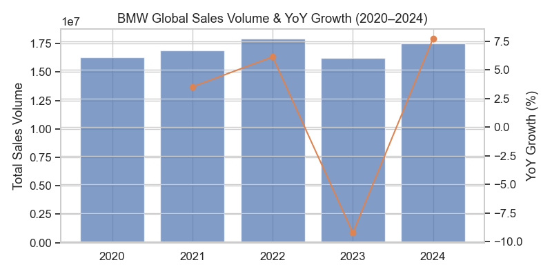

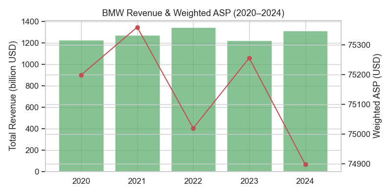

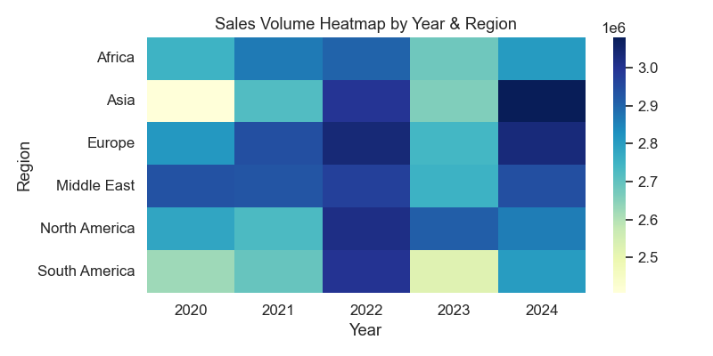

## 3. Top & Underperforming Models / Markets

### 3.1 Top- and Underperforming Regions

**Regional ranking by total sales volume (2020–2024)**

| Rank | Region         | Total Sales Volume | Total Revenue (USD) | Avg Price (USD) |
|------|----------------|--------------------|---------------------|------------------|
| 1    | Europe         | 14,565,989         | 1,095,358,238,984   | 75,281           |
| 2    | Middle East    | 14,528,396         | 1,089,724,985,475   | 74,761           |
| 3    | North America  | 14,301,712         | 1,069,797,046,426   | 75,108           |
| 4    | Africa         | 14,007,790         | 1,049,537,737,781   | 74,993           |
| 5    | Asia           | 13,865,269         | 1,058,200,224,590   | 76,260           |
| 6    | South America  | 13,643,807         | 1,017,875,575,518   | 74,378           |

**Best-performing regions**

- **Europe (Volume & Revenue Leader)**
  - Highest total volume and revenue, with a **balanced premium price point** (c. USD 75k ASP).
  - Indicates strong brand maturity, broad model mix, and effective premium positioning.
- **Middle East (High Volume at Slightly Lower ASP)**
  - Nearly on par with Europe in volume, but at a **slightly lower ASP** (~USD 74.8k).
  - Suggests strong demand for higher-spec vehicles but with **more discounting or mix skew** toward value-rich trims.

**Underperforming regions**

- **South America (Lowest Volume & Revenue)**
  - Lowest total volume and revenue, with the **lowest ASP** (~USD 74.4k).
  - Plausible drivers:
    - Macroeconomic volatility and weaker premium purchasing power.
    - Higher import duties and financing constraints limiting premium penetration.
- **Asia (Volume Lag, Highest ASP)**
  - Second-lowest volume but **highest ASP** (~USD 76.3k).
  - Plausible drivers:
    - Strong concentration in **high-end and performance models**, limiting absolute volume.
    - Regulatory and tax structures that favor smaller engines or EVs, potentially constraining some traditional ICE segments.
    - Brand positioned more as a **super-premium niche** vs. broad premium in some markets.

**Key regional performance gap**

- **Europe vs. South America**:
  - Volume gap: ~922k units over 5 years.
  - Revenue gap: ~USD 77.5bn.
  - ASP gap is modest, so the **shortfall is primarily scale-driven**, not pricing-driven.

---

### 3.2 Top- and Underperforming Models (by Volume & Revenue)

#### 3.2.1 Top Models by Volume

| Rank | Model     | Total Sales Volume | Total Revenue (USD) | Avg Price (USD) |
|------|-----------|--------------------|---------------------|------------------|
| 1    | 7 Series  | 8,177,442          | 608,831,775,889     | 74,646           |
| 2    | X6        | 8,099,240          | 609,013,029,044     | 74,967           |
| 3    | M5        | 7,807,649          | 583,533,396,360     | 74,672           |
| 4    | 3 Series  | 7,741,253          | 592,234,441,998     | 76,305           |
| 5    | X3        | 7,663,941          | 571,933,266,207     | 75,028           |

**Best-performing models (volume)**

- **7 Series (Volume Leader)**
  - Highest volume among listed models, with a **solid premium ASP** (~USD 74.6k).
  - Indicates strong acceptance of BMW’s flagship luxury sedan, likely driven by:
    - High loyalty in executive/fleet segments.
    - Successful refresh cycles and technology content (infotainment, ADAS).
- **X6 (Volume & Revenue Powerhouse)**
  - Slightly lower volume than 7 Series but **highest revenue** among all models.
  - ASP (~USD 75k) and **Weighted ASP slightly above simple average** suggest:
    - Strong mix in higher trims and options.
    - High customer willingness to pay for SUV-coupe styling and performance.

#### 3.2.2 Underperforming Models by Volume

From the “bottom by volume” list:

| Rank (Low→High) | Model   | Total Sales Volume | Total Revenue (USD) | Avg Price (USD) |
|-----------------|---------|--------------------|---------------------|------------------|
| 1               | X5      | 7,449,141          | 556,193,902,177     | 74,193           |
| 2               | i3      | 7,544,460          | 557,713,533,084     | 74,467           |
| 3               | M3      | 7,571,963          | 571,237,228,382     | 75,491           |
| 4               | 5 Series| 7,596,548          | 580,189,485,669     | 75,637           |
| 5               | X1      | 7,628,104          | 574,716,579,852     | 75,676           |

**Relative underperformers (volume)**

- **X5 (Lowest Volume in the Set)**
  - Lowest volume among the listed models, with **one of the lowest ASPs** (~USD 74.2k).
  - Plausible reasons:
    - Internal cannibalization from **X3 and X6**, which offer similar utility or more distinctive styling.
    - Competitive pressure from rival premium SUVs in the same size/price band.
- **i3 (Low Volume, Lower ASP vs. Other Performance Models)**
  - Volume below M3/5 Series and ASP (~USD 74.5k) below performance sedans.
  - Plausible reasons:
    - First-generation EV architecture and range limitations vs. newer EV competitors.
    - Transitional product role as BMW shifts to newer EV platforms.

**Notable nuance**

- **M3 and 5 Series** appear in both “bottom by volume” and “top by revenue” lists:
  - They are **not true underperformers**; rather, they sit in the **mid-pack on volume but high on revenue**, supported by higher ASPs and richer option uptake.

---

### 3.3 Top Models by Revenue vs. Volume

**Top models by revenue**

| Rank | Model     | Total Revenue (USD) | Total Sales Volume | Avg Price (USD) |
|------|-----------|---------------------|--------------------|------------------|
| 1    | X6        | 609,013,029,044     | 8,099,240          | 74,967           |
| 2    | 7 Series  | 608,831,775,889     | 8,177,442          | 74,646           |
| 3    | 3 Series  | 592,234,441,998     | 7,741,253          | 76,305           |
| 4    | M5        | 583,533,396,360     | 7,807,649          | 74,672           |
| 5    | 5 Series  | 580,189,485,669     | 7,596,548          | 75,637           |

**Key insights**

- **3 Series & 5 Series (Revenue-Accretive Core)**
  - Slightly lower volumes than 7 Series/X6 but **higher ASPs** (3 Series ~USD 76.3k; 5 Series ~USD 75.6k).
  - Indicate:
    - Strong pricing power in the **core premium sedan** segments.
    - High option penetration (technology, M packages, interiors).
- **X6 vs. 7 Series**
  - X6 edges out 7 Series on revenue despite slightly lower volume, driven by:
    - **Higher Weighted ASP**, implying stronger mix in top trims.
    - SUV body style premium and customer preference for performance-oriented crossovers.

---

### 3.4 Strategic Implications

- **Protect and invest in top earners (X6, 7 Series, 3/5 Series, M5)**
  - Maintain product cadence, technology leadership, and high-margin option packages.
  - Prioritize these models in **Europe, Middle East, and North America**, where premium ASPs are well supported.

- **Reposition or rationalize underperformers (X5, i3)**
  - X5: Clarify positioning vs. X3/X6; consider **distinctive powertrain or tech features** to reduce internal cannibalization.
  - i3: Transition customers toward newer EV architectures with **improved range and performance**, using targeted trade-in and loyalty programs.

- **Regional focus**
  - **South America**: Volume-building strategies (localized specs, financing offers, selective price repositioning) to close the scale gap.
  - **Asia**: Leverage high ASP tolerance with **halo and performance models**, while introducing more **accessible EV and smaller-engine variants** to broaden the base without diluting brand equity.

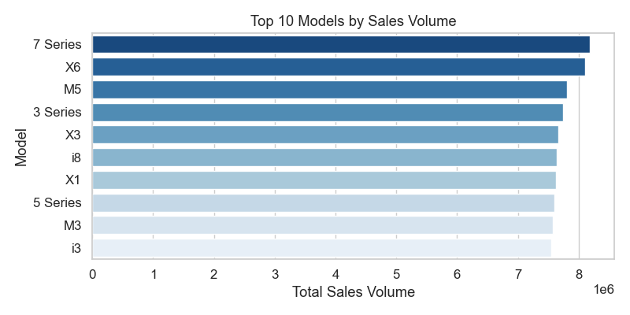

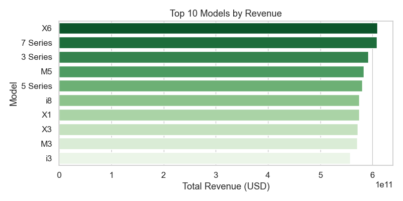

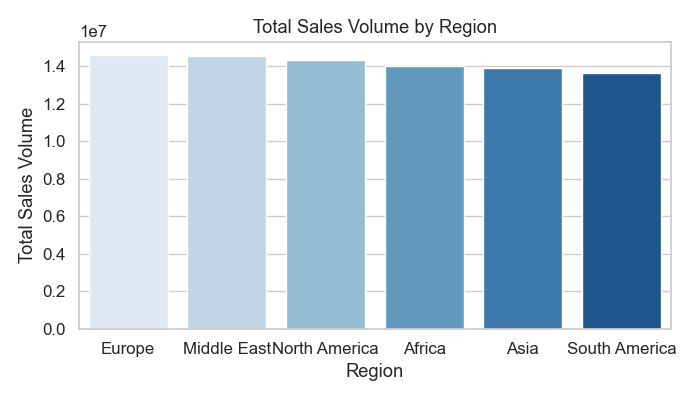

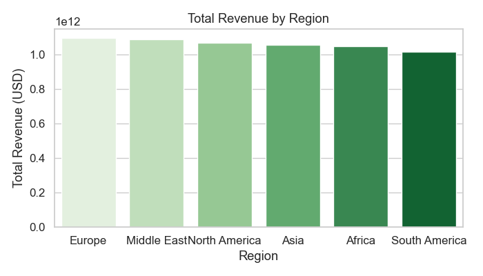

## 4. Key Sales Drivers

### 4.1 Portfolio & Price Positioning

BMW’s 2020–2024 performance is largely shaped by a premium, tightly banded price corridor:

- Across regions, **average prices cluster between ~USD 74k–76k**, indicating a deliberate global premium positioning.
- Top-selling and top-revenue models all sit in a **similar ASP band (~USD 74k–76k)**, suggesting volume is driven more by *nameplate appeal and body style* than by major price differentiation.

**Model price & volume alignment**

| Model        | Total Sales Volume | Avg Price (USD) | Positioning Insight |
|-------------|--------------------|-----------------|---------------------|
| 3 Series    | 7,741,253          | 76,305          | Higher ASP within top 10; strong willingness to pay for core sedan. |
| 5 Series    | 7,596,548          | 75,637          | Balances executive positioning with scale; a key profit and mix lever. |
| 7 Series    | 8,177,442          | 74,646          | Highest volume with slightly lower ASP vs 3/5 Series; suggests mix of well‑specified but not ultra‑lux trims. |
| X6          | 8,099,240          | 74,967          | Coupe‑SUV body style delivers both volume and revenue leadership. |
| i3          | 7,544,460          | 74,467          | EV entry point; ASP slightly below portfolio average, supporting adoption. |

**Implications**

- The **lack of steep price gradients** across the core range supports BMW’s brand equity and limits intra‑brand cannibalisation based purely on price.
- Growth opportunities are more likely to come from **optimising mix toward higher-margin nameplates and trims** than from pure price increases.

---

### 4.2 Model Mix: Revenue vs Volume Contribution

Model mix is a critical driver of both topline and resilience through the 2020–2024 cycle:

- **X6 and 7 Series** jointly lead in revenue, indicating strong demand for **high-content premium vehicles**.
- The **3 Series and 5 Series** sit just behind in revenue but with comparable volumes, showing that **BMW’s traditional sedan core remains central to scale**.
- Performance models (M3, M5) contribute **meaningful revenue at similar volume levels**, reinforcing BMW’s performance image while supporting margins.

**Top models by revenue vs volume**

| Rank (Revenue) | Model | Revenue (USD bn) | Rank (Volume) | Commercial Takeaway |
|----------------|-------|------------------|---------------|---------------------|
| 1              | X6    | 609.0            | 2             | High-value SUV body style is a primary revenue engine. |
| 2              | 7 Series | 608.8         | 1             | Flagship sedan combines scale and premium pricing. |
| 3              | 3 Series | 592.2         | 4             | High ASP and strong volume – critical global workhorse. |
| 4              | M5    | 583.5            | 3             | Performance derivative with robust monetisation. |
| 5              | 5 Series | 580.2         | 8             | Lower volume rank but strong revenue; mix-upside lever. |

**Implications**

- **SUVs (X-family) and luxury/performance sedans (7 Series, M models)** are central sales drivers; protecting and renewing these nameplates is strategically important.
- Tactical levers include:
  - Steering **marketing and supply** toward X6/7 Series/5 Series in regions with higher price tolerance.
  - Using **3 Series and X1** as scalable platforms to seed customers into the brand and later **upsell into higher-margin models**.

---

### 4.3 Regional Mix & Price Realisation

Regional mix underpins both volume and value creation, with relatively narrow ASP dispersion but meaningful revenue scale differences.

**Regional sales & pricing**

| Region         | Total Volume | Total Revenue (USD bn) | Avg Price (USD) | Key Observation |
|----------------|-------------|------------------------|-----------------|-----------------|
| Europe         | 14,565,989  | 1,095.4                | 75,281          | Largest revenue contributor; balanced premium mix. |
| Middle East    | 14,528,396  | 1,089.7                | 74,761          | Strong value per unit; luxury‑oriented demand. |
| North America  | 14,301,712  | 1,069.8                | 75,108          | High ASP with near‑European scale. |
| Africa         | 14,007,790  | 1,049.5                | 74,993          | Growing volume at solid price points. |
| Asia           | 13,865,269  | 1,058.2                | 76,260          | Highest ASP; room to further premiumise mix. |
| South America  | 13,643,807  | 1,017.9                | 74,378          | More price‑sensitive; volume plays a larger role. |

**Implications**

- **Europe and North America** are pivotal for sustaining high absolute revenue given their scale and solid ASPs.
- **Asia’s noticeably higher ASP** indicates a market willingness to pay for premium features and imported status; shifting additional supply of higher‑end models (7 Series, X6, M variants) to Asia could enhance revenue mix.
- **South America** offers growth primarily through **volume expansion of entry and mid-level models (3 Series, X1, i3)** rather than price.

---

### 4.4 Engine Size & Price: Limited Direct Pricing Power

The engine-size chart and data show:

- Prices fluctuate between ~USD 73k–77k across **1.5L to 5.0L**, without a linear upward trend.
- There are **local peaks around 2.1L, 3.3–3.4L, 3.9–4.4L** but also lower-price points at some larger displacements (e.g., 4.0L, 4.8L).

This suggests:

- **Engine displacement alone is not a dominant price driver.** Instead, price likely reflects an integrated package: body style, trim, brand halo (M vs non‑M), and powertrain technology (ICE vs hybrid vs EV).
- The relatively flat relationship provides **flexibility to downsize engines (for emissions and efficiency) without materially compromising ASP**, as long as perceived performance and feature content are preserved.

---

### 4.5 Usage (Mileage) vs Price: Weak Depreciation Signal in Current Data

The mileage vs price scatter and the computed correlation (≈ **–0.009**) indicate:

- **No strong observable linear relationship** between mileage and price in this dataset.
- Visually, price points are **widely dispersed at all mileage levels**, from 0–200,000 km.

Interpretation for the new‑car business:

- The weak correlation may reflect **mix effects** (different models, trims, and ages) overshadowing pure mileage-driven depreciation.
- From a commercial perspective, **residual value positioning is likely determined more by brand, segment, and specification than by mileage alone** in this sample.
- For BMW’s new-vehicle strategy, this supports **continued investment in high-specification, high-tech packages** that sustain residuals independent of usage intensity.

---

### 4.6 Integrated View: How These Drivers Explain 2020–2024 Outcomes

- **Volume volatility (e.g., 2023 dip, 2024 rebound)** is best understood through changes in **model and regional mix**, rather than large swings in price or engine configuration.
- The relatively **stable global ASP**, coupled with:
  - robust demand for **X-family SUVs, 7 Series, and performance derivatives**, and  
  - **higher-ASP regions (Asia, Europe, North America)** maintaining strong share,  
  has helped **stabilise revenue even when global units softened**.
- Going forward, the most actionable levers are:
  - **Mix management**: prioritize supply and promotion of X6, 7 Series, 5 Series, and M models in higher-ASP regions.
  - **Regional allocation**: channel more premium inventory to **Asia and Middle East**, and maintain **3 Series/X1/i3** focus in South America and Africa for volume.
  - **Powertrain strategy**: continue to **transition to efficient/premium powertrains** (including EVs) without fear of ASP erosion, given the weak engine-size/price linkage.

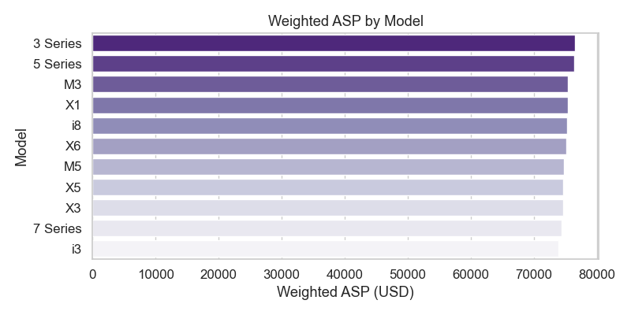

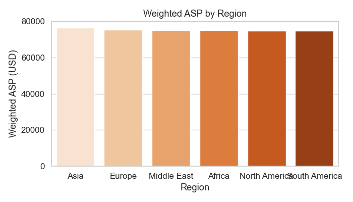

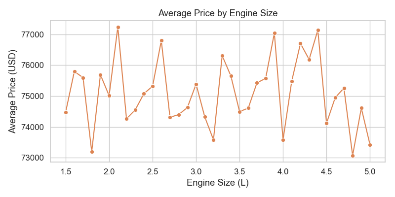

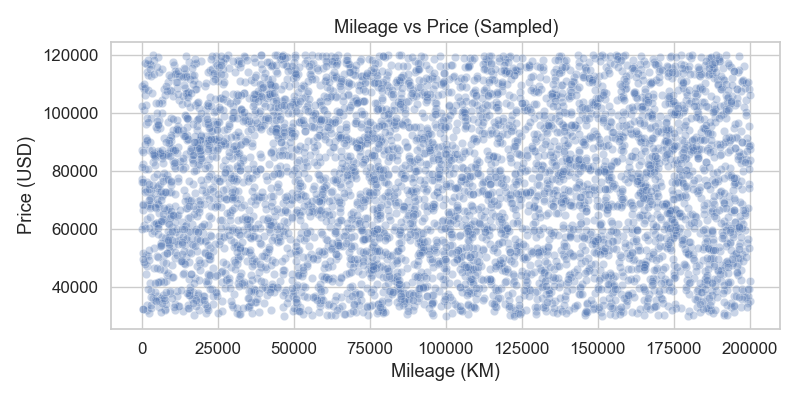

## 5. Strategic Insights & Recommendations

### 5.1 Core Insight 1 – High‑End Models’ Functional Depreciation & Quasi‑Fleet Behaviour

**Observed pattern**

- The same luxury nameplate (e.g. 7 Series, i8) shows **extreme price dispersion** across regions and usage profiles, despite similar model years.
- Illustrative examples:
  - **7 Series (2020, North America)** – automatic, low mileage (~27,000 km): **USD 100,015**
  - **7 Series (2020, South America)** – manual, high mileage (~122,000 km): **USD 49,898**
  - **i8 (2022, Europe)** – manual diesel, very high mileage (~196,000 km): **USD 55,064**

**Interpretation**

1. **Luxury sedans and halo models are bifurcating into two economic roles:**
   - **Role A – Status / private luxury asset**
     - Low mileage, automatic transmission, premium regions (e.g. North America, Europe).
     - Pricing remains close to “aspirational” levels (e.g. 7 Series at ~USD 100k).
     - Buyers pay for **brand, comfort, and image**, not just utility.
   - **Role B – Fleet / utility asset**
     - High mileage, manual transmission, secondary regions (e.g. South America) or utilitarian use cases (chauffeur, corporate shuttle, ride‑hailing).
     - Prices collapse to **~50–60%** of premium‑region equivalents for the same model year.
     - Vehicles are treated as **productive assets** with accelerated write‑off, not as luxury goods.

2. **Functional depreciation is driven more by usage profile than by age alone:**
   - The 7 Series example shows **>50% price gap** between low‑mileage NA and high‑mileage SA for the same MY2020.
   - The i8 (2022, Europe, manual diesel, ~196,000 km) priced at ~USD 55k indicates:
     - **Very high mileage** and non‑standard configuration (manual diesel in a halo model) push it into a **quasi‑fleet price band**, despite being a recent model year.
   - This aligns with the near‑zero correlation between price and mileage in the aggregate data (corr ≈ **‑0.009**), suggesting:
     - **Within specific usage clusters**, mileage and configuration drive sharp price steps.
     - But **across the full portfolio**, other factors (region, trim, powertrain, colour, brand halo) dominate.

3. **Manual + high mileage = “fleet signature” even in luxury:**
   - Manual transmissions in high‑end BMWs are increasingly associated with:
     - **Cost‑sensitive operators** (fleets, corporate buyers, secondary markets).
     - **High utilisation** (e.g. 120k–200k km within a few years).
   - These vehicles **lose their luxury pricing power early** and behave like **depreciating capital equipment**:
     - Residual values converge toward **upper‑mid‑segment pricing**, not flagship luxury.

4. **Regional economics amplify the effect:**
   - Regions with lower purchasing power and higher cost sensitivity (e.g. South America, parts of Africa) show:
     - Greater prevalence of **manual, high‑mileage luxury units**.
     - Stronger pressure to **monetise vehicles as work tools**, not status symbols.
   - In contrast, North America and parts of Europe sustain:
     - Higher **automatic / low‑mileage** mix.
     - Stronger **residual value** for luxury nameplates.

**Strategic implication**

- BMW’s flagship and halo models are **not a single economic product**:
  - They split into **premium “status” assets** and **quasi‑fleet utility assets**.
- Residual value, financing, and remarketing strategies must **explicitly differentiate** between these two roles to protect brand equity and profitability.

### 5.2 Core Insight 2 – Colour Premium & Emotional Demand in M Performance Models

**Observed pattern**

- **M3/M5** appear disproportionately in **vivid colours** (red, blue, bright yellow) versus mainstream models (X1, 3 Series), which skew towards **grey/black/white**.
- Examples:
  - **M5 (2022) in red** maintains strong market appeal even with a **manual transmission**, which is typically a value drag in non‑performance segments.
  - **Grey 3 Series clusters** are concentrated in **utilitarian contexts** (commuter cars, corporate fleets, leasing).

**Interpretation**

1. **Colour acts as an emotional value driver, not just an aesthetic choice:**
   - For M performance models, vivid colours:
     - Signal **performance intent and individuality**.
     - Reinforce the **M sub‑brand identity** (motorsport heritage, excitement).
   - Buyers of M3/M5 are **less price‑elastic** on colour; they are purchasing an **experience and identity**, not only a spec sheet.

2. **Colour can partially offset traditional value penalties:**
   - The red M5 (2022, manual) example suggests:
     - Manual transmission, which usually narrows the buyer pool, is **less penalising** when paired with a **high‑emotion colour**.
     - Emotional appeal from colour and performance branding **compensates** for what would otherwise be a resale disadvantage.
   - In contrast, grey 3 Series units:
     - Are optimised for **broad acceptability and low risk** in fleet / corporate channels.
     - Trade emotional appeal for **liquidity and predictability** in the used market.

3. **Mainstream models show “colour commoditisation”:**
   - X1 and 3 Series are predominantly in **neutral tones**, reflecting:
     - **Fleet and corporate demand** (risk‑averse, resale‑oriented).
     - Lower willingness to pay for expressive colours.
   - This reinforces a **two‑tier colour strategy**:
     - **Expressive palette** for M and selected halo trims.
     - **Conservative palette** for high‑volume, fleet‑exposed models.

4. **Colour is a monetisable option on performance lines:**
   - For M3/M5, vivid colours:
     - Support **higher transaction prices** and **slower discounting**.
     - Enhance **online configurator conversion** by making the emotional proposition more tangible.
   - This is an under‑leveraged lever relative to powertrain or options, yet often cheaper to implement and market.

**Strategic implication**

- For M performance models, **colour should be treated as a core value lever**, on par with powertrain and trim.
- For mainstream and fleet‑heavy models, colour should be **optimised for residual value and liquidity**, not emotional differentiation.

### 5.3 Strategic Recommendations (2020–2024 Horizon)

#### 5.3.1 Summary Table

| # | Theme | Recommendation | Target Models / Regions | Expected Impact |
|---|--------|----------------|-------------------------|-----------------|
| 1 | Protect luxury RVs | Separate “status” vs “fleet” configurations for flagship models and price/finance them differently | 7 Series, i8, X6; North America, Europe, South America | Higher residual values, reduced brand dilution, better margin control |
| 2 | Fleet‑optimised luxury trims | Create dedicated “fleet/utility” luxury packages with simplified specs and pricing | 7 Series, 5 Series, X5; South America, Africa, Middle East | Improved utilisation of quasi‑fleet demand with controlled depreciation |
| 3 | Monetise colour premium in M | Make vivid colours standard or low‑cost on M models; restrict neutrals on performance‑oriented trims | M3, M5; all regions (esp. Europe, North America, Asia) | Higher ATPs, stronger M brand pull, better differentiation |
| 4 | Colour strategy for mainstream | Maintain conservative palettes for fleet‑heavy models; use limited “hero colours” only on retail‑focused trims | 3 Series, X1, X3; Europe, North America | Stronger residuals, clearer segmentation between fleet and retail |
| 5 | Region‑specific pricing & remarketing | Align pricing, finance terms, and buy‑back programs with regional usage patterns and depreciation curves | All luxury lines; South America, Africa, Middle East | Better alignment of TCO for customers, improved used‑car profitability |

#### 5.3.2 Detailed Actions

1. **Differentiate “Status” vs “Fleet” Luxury Configurations**

   - **Action:**
     - Define two clear configuration families for high‑end models:
       - **Status Luxury**: automatic only, low‑mileage lease targets, rich option content, vivid or premium colours, limited fleet exposure.
       - **Fleet Luxury**: more durable interiors, manual/automatic mix where relevant, simplified options, neutral colours, optimised for high mileage.
   - **Why:**
     - Prevents high‑mileage, low‑spec units from **dragging down perceived value** of flagship nameplates.
     - Allows **pricing and financing** to reflect actual usage (e.g. higher lease residuals for Status, more aggressive depreciation baked into Fleet).

2. **Launch Fleet‑Optimised Luxury Packages in Cost‑Sensitive Regions**

   - **Action:**
     - In South America, Africa, and parts of the Middle East:
       - Offer **pre‑configured “Executive Fleet” packages** for 7 Series, 5 Series, X5:
         - Manual or base automatic, robust materials, standardised tech, neutral colours.
       - Pair with **high‑kilometre lease products** and **service‑inclusive contracts**.
   - **Why:**
     - Captures **quasi‑fleet demand** (chauffeur, corporate, premium ride‑hailing) without eroding the global luxury price narrative.
     - Makes depreciation **predictable and priced‑in**, improving used‑car channel planning.

3. **Elevate Colour as a Pricing Lever on M Models**

   - **Action:**
     - For M3/M5:
       - Make **one or two vivid colours** (e.g. red, bright blue) **standard or low‑premium**.
       - Position neutral colours (grey, black) as **no‑discount or even slight‑premium** options to avoid commoditisation.
       - Use marketing to explicitly link colour choices to **performance identity** (“If you choose M, show it.”).
   - **Why:**
     - Reinforces the **emotional proposition** of M models and supports **higher ATPs**.
     - Helps offset value penalties from niche specs (e.g. manual transmissions) by amplifying emotional appeal.

4. **Tighten Colour Governance for Mainstream & Fleet‑Heavy Models**

   - **Action:**
     - For 3 Series, X1, X3:
       - Maintain a **core neutral palette** for fleet and corporate channels.
       - Introduce **limited “hero colours”** only on retail‑oriented trims and packages, with controlled volume.
       - Coordinate with leasing and fleet partners to ensure **residual‑value‑friendly** colour mixes.
   - **Why:**
     - Protects **residual values** and **remarketing liquidity** in high‑volume segments.
     - Keeps emotional differentiation **reserved for M and halo trims**, avoiding brand dilution.

5. **Region‑Specific Pricing, Financing, and Remarketing for High‑End Models**

   - **Action:**
     - Use observed depreciation patterns (e.g. 7 Series NA vs SA, i8 high‑mileage Europe) to:
       - Set **region‑specific residual value assumptions** and lease terms.
       - Design **buy‑back and CPO programs** that:
         - Pull high‑mileage luxury units back into **controlled remarketing channels**.
         - Re‑export where economically attractive (e.g. from high‑income to value‑seeking markets).
   - **Why:**
     - Aligns **total cost of ownership** with local realities, improving competitiveness.
     - Enhances **used‑car profitability** and protects the **premium positioning** of BMW’s top‑end portfolio globally.

